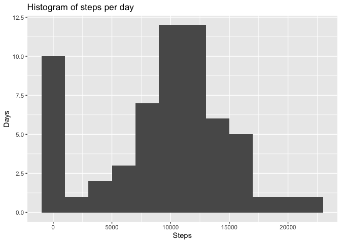
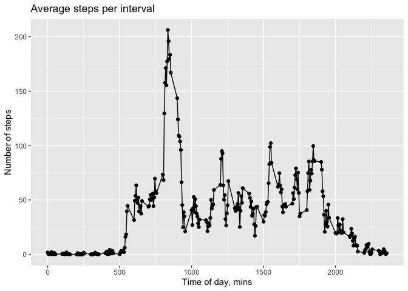
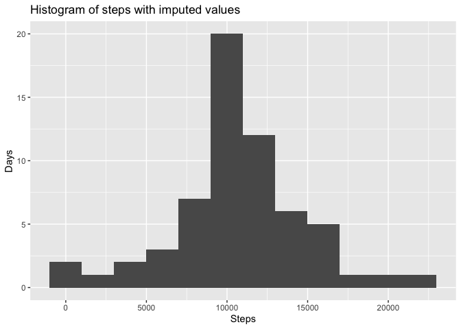
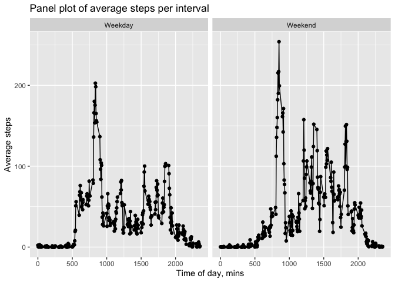

## Loading and preprocessing the data

Unzip the activity.zip file

```r
unzip('activity.zip')
```

Read the unzipped activity.csv file into activity_df dataframe

```r
activity_df <- data.frame(read.csv('activity.csv'))
```

## What is mean total number of steps taken per day?

Calculate the steps per day with NA data removed. First, we aggregate steps, grouping by date. Then we plot the histogram of steps per day. Finally, we find the mean and the median and print them.

```r
library(ggplot2)
```

```
## Warning: package 'ggplot2' was built under R version 4.0.2
```

```r
library(dplyr)
```

```
## 
## Attaching package: 'dplyr'
```

```
## The following objects are masked from 'package:stats':
## 
##     filter, lag
```

```
## The following objects are masked from 'package:base':
## 
##     intersect, setdiff, setequal, union
```

```r
steps_per_date <- aggregate(activity_df$steps, by=list(date=activity_df$date), sum, na.rm=TRUE)
hist_steps_per_day <- ggplot(data=steps_per_date, aes(x)) + 
  geom_histogram(binwidth=2000) + labs(title="Histogram of steps per day",
                                       x="Steps", y="Days")
ggsave("hist_steps_per_day.png", plot = hist_steps_per_day, path = "figures")
```

```
## Saving 7 x 5 in image
```

```r
hist_steps_per_day
```

<!-- -->

```r
mean_per_day <- mean(steps_per_date$x)
sprintf("Mean of steps per day: %.2f", mean_per_day)
```

```
## [1] "Mean of steps per day: 9354.23"
```

```r
median_per_day <- median(steps_per_date$x)
sprintf("Median of steps per day: %.2f", median_per_day)
```

```
## [1] "Median of steps per day: 10395.00"
```

## What is the average daily activity pattern?

Calculate the average steps per 5 minute interval and plot the time series.

```r
five_min_intervals_split <- split(activity_df$steps, f=activity_df$interval)
intervals <- unique(activity_df$interval)
five_min_intervals_avg <- as.data.frame(cbind(sapply(five_min_intervals_split, mean, na.rm=TRUE), intervals))
names(five_min_intervals_avg)[1] <- "steps"
five_min_intervals_plot <- ggplot(five_min_intervals_avg, aes(x=intervals, y=steps)) + geom_line() + geom_point() +
  labs(title="Average steps per interval", x="Time of day, mins", y="Number of steps")
five_min_intervals_plot
```

<!-- -->

```r
ggsave("avg_steps_per_interval.png", plot=five_min_intervals_plot, path="figures")
```

```
## Saving 7 x 5 in image
```

Find the interval containing the maximum number of steps

```r
max_steps <- max(five_min_intervals_avg$steps)
max_interval <- five_min_intervals_avg[five_min_intervals_avg$steps ==
                                         max_steps,2]
sprintf("Maximum average steps per interval: %.2f", max_steps)
```

```
## [1] "Maximum average steps per interval: 206.17"
```

```r
sprintf("Interval with maximum average steps: %d", max_interval)
```

```
## [1] "Interval with maximum average steps: 835"
```

## Imputing missing values

Calculate the number of missing data

```r
num_nas <- sum(!complete.cases(activity_df))
sprintf("Number of rows of missing data in activity: %d", num_nas)
```

```
## [1] "Number of rows of missing data in activity: 2304"
```

Impute missing values into activity_df. The strategy is to substitute the average value for that interval from five_min_intervals_avg using dplyr mutate function.

```r
nr_of_days <- length(unique(activity_df$date))
imputed_steps <- rep(five_min_intervals_avg$steps, times=nr_of_days)
activity_df_imputed <- activity_df %>% mutate(imputed_steps = ifelse(is.na(steps), imputed_steps, steps))
```

Plot the histogram of the number of steps and calculate the mean and the median of steps per day.

```r
imputed_steps_per_date <- aggregate(activity_df_imputed$imputed_steps, by=list(date=activity_df_imputed$date), sum)
avg_steps_per_day_imputed_plot <- ggplot(imputed_steps_per_date, aes(x)) + geom_histogram(binwidth = 2000) +
  labs(title="Histogram of steps with imputed values", x="Steps", y="Days")
ggsave("avg_steps_per_day_imputed_plot.png", plot = avg_steps_per_day_imputed_plot, path="figures")
```

```
## Saving 7 x 5 in image
```

```r
avg_steps_per_day_imputed_plot
```

<!-- -->

```r
mean_steps_imputed <- mean(imputed_steps_per_date$x)
median_steps_imputed <- median(imputed_steps_per_date$x)
sprintf("Mean of imputed steps per day: %.2f", mean_steps_imputed)
```

```
## [1] "Mean of imputed steps per day: 10766.19"
```

```r
sprintf("Median of imputed steps per day: %.2f", median_steps_imputed)
```

```
## [1] "Median of imputed steps per day: 10766.19"
```
## Are there differences in activity patterns between weekdays and weekends?

Create a date frame activity_df_imputed_week with a factor column week with weekday and weekend days. Group by interval and type of the day of the week. Make the panel plot.

```r
library(lubridate)
```

```
## 
## Attaching package: 'lubridate'
```

```
## The following objects are masked from 'package:base':
## 
##     date, intersect, setdiff, union
```

```r
activity_df_imputed_week <- activity_df_imputed %>% mutate(week = case_when(wday(date) == 1 ~ "Weekday", wday(date) == 2 ~ "Weekday",
    wday(date) == 3 ~ "Weekday", wday(date) == 4 ~ "Weekday", wday(date) == 5 ~ "Weekday", wday(date) == 6 ~ "Weekend", wday(date) == 7 ~ "Weekend")) %>% group_by(interval, week) %>% summarize(mean(imputed_steps))
```

```
## `summarise()` regrouping output by 'interval' (override with `.groups` argument)
```

```r
names(activity_df_imputed_week)[3] <- "imputed_steps"
weekday_plot <- ggplot(activity_df_imputed_week, aes(x=interval, y=imputed_steps)) + geom_line() + geom_point() + labs(title="Panel plot of average steps per interval", x="Time of day, mins", y="Average steps") + facet_wrap(~ week)
ggsave("weekday_plot.png", plot = weekday_plot, path = "figures")
```

```
## Saving 7 x 5 in image
```

```r
weekday_plot
```

<!-- -->
